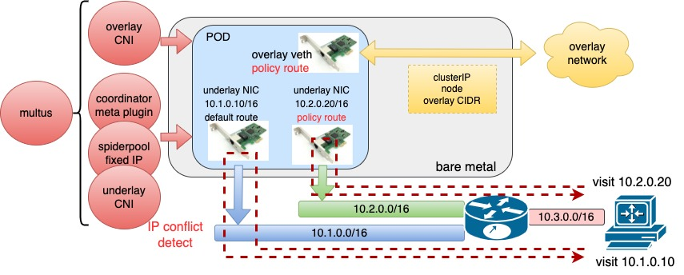
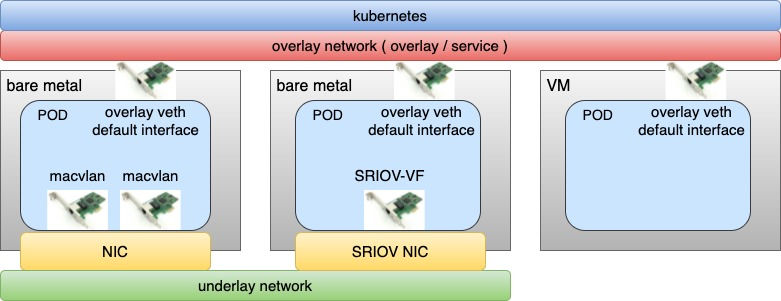

# Spiderpool

[**English**](./README.md) | **简体中文**

## Spiderpool 介绍

Spiderpool 是一个 kubernetes 的 underlay 网络解决方案，通过提供两个轻量级的插件，spiderpool 灵活地整合和强大了开源社区中的现有 CNI 项目，最大地简化 underlay IPAM 运维工作，使得多 CNI 协同工作真正的可落地：

* Spiderpool: IPAM plugin，针对 underlay 网络的 IP 地址管理需求而设计，能为各种开源 CNI 项目分配 underlay IP 地址

* coordinator: metal plugin，能够实现各种辅助需求，包括多网卡路由调协、IP 冲突检查、宿主机联通等。

为什么希望研发 Spiderpool ?  underlay 网络中 IPAM 需求比较复杂，当前开源社区中并未提供全面、友好、智能的开源解决方案。
Spiderpool 因此提供了很多创新的功能：

* 提供共享和独享的 IP 池，支持应用固定 IP 地址，满足防火墙的安全管控等需求。

* 通过监控应用编排事件，自动化管理独享的 IP 池，实现固定 IP 地址的动态创建、扩容、缩容和回收，实现零运维。

* 支持多网卡的 IP 分配，并调协所有网卡之间的路由，确保请求向和回复向数据路径一致，保证通信畅通。

* 实现“多个 underlay CNI 协同”和“overlay CNI 和 underlay CNI 协同”等方案，能有效降低集群节点的硬件一致要求，充分利用各种基础设施资源。

* 增强了开源社区中很多的 underlay CNI，打通 Pod 和宿主机的连通性，使得 clusterIP 访问、应用本地健康检测等通信成功，并且支持 Pod 的 IP 冲突检测、网关可达性检测等，使得 Macvlan、SR-IOV 等项目真正地可落地。

## underlay 网络 和 overlay 网络场景的比较

云原生网络中出现了两种技术类别，" overlay 网络方案" 和 " underlay网络方案"，
云原生网络对于它们没有严格的定义，我们可以从很多 CNI 项目的实现原理中，简单抽象出这两种技术流派的特点，它们可以满足不同场景下的需求。

[文章](./docs/concepts/solution-zh_CN.md) 对两种方案的 IPAM 和网络性能做了简单比较，能够更好说明 Spiderpool 的特点和使用场景。

为什么需要 underlay 网络解决方案？在数据中心的场景下，存在很多应用场景：

* 低延时应用的需求，underlay 网络方案的网络延时和吞吐量会优于 overlay 网络方案

* 传统主机应用上云初期，还沿用传统网络的对接方式，例如服务暴露和发现、多子网对接等

* 数据中心网络管理的需求，希望使用防火墙等手段对应用实施安全管控，希望使用传统的网络观测手段实施集群网络监控

## 架构

Spiderpool 架构如上所示，包含了以下组件：

* Spiderpool controller: 是一组 deployment，实施了对各种 CRD 校验、状态更新、IP 回收、自动 IP 池的管理等

* Spiderpool agent：是一组 daemonset，其帮助 Spiderpool plugin 实施 IP 分配，帮助 coordinator plugin 实施信息同步

* Spiderpool plugin：在每个主机上的二进制插件，供 CNI 调用，实施 IP 分配

* coordinator plugin：在每个主机上的二进制插件，供 CNI 调用，实施多网卡路由调协、IP 冲突检查、宿主机联通等

除了以上 Spiderpool 自身的组件以外，还需要配合某个开源的 underlay CNI 来给 Pod 分配网卡，可配合 [Multus CNI](https://github.com/k8snetworkplumbingwg/multus-cni) 来实施多网卡和 CNI 配置管理。

任何支持第三方 IPAM 插件的 CNI 项目，都可以配合 Spiderpool，例如：
[Macvlan CNI](https://github.com/containernetworking/plugins/tree/main/plugins/main/macvlan), 
[vlan CNI](https://github.com/containernetworking/plugins/tree/main/plugins/main/vlan), 
[ipvlan CNI](https://github.com/containernetworking/plugins/tree/main/plugins/main/ipvlan), 
[SR-IOV CNI](https://github.com/k8snetworkplumbingwg/sriov-cni), 
[ovs CNI](https://github.com/k8snetworkplumbingwg/ovs-cni), 
[Multus CNI](https://github.com/k8snetworkplumbingwg/multus-cni)
[Calico CNI](https://github.com/projectcalico/calico), 
[Weave CNI](https://github.com/weaveworks/weave)

## 应用场景 1：一个或多个 underlay CNI 协同

如上所示，spiderpool 工作在 underlay 模式下，可配合 underlay CNI （例如 [Macvlan CNI](https://github.com/containernetworking/plugins/tree/main/plugins/main/macvlan), [SR-IOV CNI](https://github.com/k8snetworkplumbingwg/sriov-cni) ）实现:

* 为 underlay CNI 提供丰富的 IPAM 能力,包括共享/固定 IP、多网卡 IP 分配、双栈支持等

* 为 Pod 接入一个或者多个 underlay 网卡，并能调协多个 underlay CNI 网卡间的路由，以实现请求向和回复向数据路径一致，确保网络通信畅通

* 通过额外接入 veth 网卡和路由控制，帮助开源 underlay CNI 联通宿主机，实现 clusterIP 访问、应用的本地健康检测等

当一个集群中存在多种基础设置时，如何使用单一的 underlay CNI 来部署容器呢？

* 在一个集群中，部分节点是虚拟机，例如未打开混杂转发模式的 vmware 虚拟机，而部分节点是裸金属，接入了传统交换机网络。因此在两类节点上部署什么 CNI 方案呢 ？

* 在一个集群中，部分裸金属节点只具备一张 SR-IOV 高速网卡，但只能提供 64 个 VF，如何在一个节点上运行更多的 Pod？

* 在一个集群中，部分裸金属节点具备 SR-IOV 高速网卡，可以运行低延时应用，部分节点不具备 SR-IOV 高速网卡，可以运行普通应用。但在两类节点部署上什么 CNI 方案呢 ？

结合 multus 的 CNI 配置管理和 spiderpool IPAM 的通用性，可同时运行多种 underlay CNI，充分整合集群中各种基础设施节点的资源，来解决以上问题。

例如上图所示，在同一个集群下具备不同网络能力的节点， 有的节点具备 SR-IOV 网卡，可运行 SR-IOV CNI，有的节点具备普通的网卡，可运行 Macvlan CNI ，有的节点网络访问受限（例如二层网络转发受限的 vmware 虚拟机），可运行 ipvlan CNI。

## 应用场景 2：overlay CNI 和 underlay CNI 协同

如上所示，spiderpool 工作在 overlay 模式下，使用 multus 同时为 Pod 插入一张 overlay 网卡（例如 [Calico](https://github.com/projectcalico/calico), [Cilium](https://github.com/cilium/cilium) ）和若干张 underlay 网卡（例如 [Macvlan CNI](https://github.com/containernetworking/plugins/tree/main/plugins/main/macvlan), [SR-IOV CNI](https://github.com/k8snetworkplumbingwg/sriov-cni) ），可实现:

* 为 underlay CNI 提供丰富的 IPAM 能力,包括共享/固定 IP、多网卡 IP 分配、双栈支持等

* 为 Pod 的多个 underlay CNI 网卡和 overlay 网卡调协路由，以实现请求向和回复向数据路径一致，确保网络通信畅通

* 以 overlay 网卡作为缺省网卡，并调协路由，通过 overlay 网卡联通本地宿主机，实现 clusterIP 访问、应用的本地健康检测、overlay 网络流量通过 overlay 网络转发，而 underlay 网络流量通过 underlay 网卡转发。

结合 multus 的 CNI 配置管理和 Spiderpool IPAM 的通用性，可同时运行一种 overlay CNI 和 多种 underlay CNI。例如，在同一个集群下具备不同网络能力的节点， 裸金属节点上的 Pod 同时接入 overlay CNI 和 underlay CNI 网卡，虚拟机节点上的 Pod 只提供集群东西向服务，只接入 overlay CNI 网卡。
带来了如下好处：

* 把提供东西向服务的应用只接入 overlay 网卡，提供南北向服务的应用同时接入 overlay 和 underlay 网卡，在保障集群内 Pod 连通性基础上，能够降低 underlay IP 资源的用量，减少相应的人工运维成本

* 充分整合虚拟机和裸金属节点资源

## 快速开始

快速搭建 Spiderpool，启动一个应用，可参考 [快速搭建](./docs/usage/install.md).

## 核心功能

* 创建多个 underlay 子网

  管理员可创建多个子网，不同应用可指定使用不同子网的 IP 地址，满足 underlay 网络的各种复杂规划。可参考 [例子](./docs/usage/multi-interfaces-annotation.md)

* 自动化 IP 池，帮助应用 IP 地址固定

    对于应用 IP 地址固定的需求，当前开源社区，一些项目的做法是在应用的 annotaiton 中 hard code IP 地址，人为失误容易导致应用间 IP 地址冲突，应用扩缩容时 IP 地址修改成本高。
    Spiderpool 提供了 CRD 化管理 IP 固定池，这种池能够自动创建、删除、扩缩容 IP 数量，让运维工作量最小化。

  * 对无状态应用，可实现自动固定 IP 地址范围，且能够自动跟随应用副本数进行 IP 资源扩缩容和删除。可参考 [例子](./docs/usage/spider-subnet.md)

  * 对有状态应用，可自动为每个 Pod 固定 IP 地址，并且也可固定整体的 IP 扩缩容范围。可参考 [例子](./docs/usage/statefulset.md)

  * 自动化 IP 池能够保持一定数量的冗余 IP 地址，以确保应用在滚动发布时，新启动 Pod 能够有临时 IP 地址可用。 可参考 [例子](./docs/usage/spider-subnet.md)

  * 支持基于operator等机制实现的第三方应用控制器. 可参考 [例子](./docs/usage/third-party-controller.md)

* 手动 IP 池，管理员能够自定义固定 IP 地址，帮助应用固定 IP 地址。可参考 [例子](./docs/usage/ippool-affinity-pod.md)

* 对于没有 IP 地址固定需求的应用，可共同使用一个共享 IP 池。可参考 [例子](./docs/usage/ippool-affinity-pod.md#shared-ippool)

* 对于一个跨子网部署的应用，支持为其不同副本分配不同子网的 IP 地址。可参考 [例子](./docs/usage/ippool-affinity-node.md)

* 应用可设置多个 IP 池，实现 IP 资源的备用效果。可参考 [例子](./docs/usage/ippool-multi.md)

* 设置全局的 IP 预留，使得集群不会分配出这些 IP 地址，这样能避免与集群外部的已用 IP 冲突。可参考 [例子](./docs/usage/reserved-ip.md)

* 能够为一个具备多网卡的 Pod 分配不同子网下的 IP 地址。可参考 [例子](./docs/usage/multi-interfaces-annotation.md)

* IP 池可配置为全局可共享，也可实现同指定租户的绑定。可参考 [例子](./docs/usage/ippool-affinity-namespace.md)

* 帮助一些 CNI 解决 ClusterIP 访问、Pod 宿主机健康检查等问题，例如 [Macvlan CNI](https://github.com/containernetworking/plugins/tree/main/plugins/main/macvlan), 
[vlan CNI](https://github.com/containernetworking/plugins/tree/main/plugins/main/vlan), 
[ipvlan CNI](https://github.com/containernetworking/plugins/tree/main/plugins/main/ipvlan), 
[SR-IOV CNI](https://github.com/k8snetworkplumbingwg/sriov-cni), 
[ovs CNI](https://github.com/k8snetworkplumbingwg/ovs-cni). 可参考 [例子](./docs/usage/get-started-macvlan.md)

* Pod 被 [Multus](https://github.com/k8snetworkplumbingwg/multus-cni) 分配多网卡时，可帮助各个网卡之间协调策略路由。

    对于多个 underlay CNI 网卡场景，可参考 [例子](./docs/usage/multi-interfaces-annotation.md) 

    对于一个 overlay 网卡和多个 underlay CNI 网卡场景，可参考 [例子](./docs/usage/install/overlay/get-started-calico.md)

* 在 Pod 初始化网络命名空间时，能够实施 IP 地址冲突检测和网关可达性检测，以保证 Pod 通信正常。可参考 [例子](./docs/usage/coodinator.md)

* 合理的 IP 回收机制设计，可最大保证 IP 资源的可用性。可参考 [例子](./docs/usage/gc.md)

* 管理员可以为 Pod 添加额外的自定义路由， 可参考 [例子](./docs/usage/route.md)

* 分配和释放 IP 地址的高效性能，[报告](docs/usage/performance-zh_CH.md)以其它开源项目为比较，涵盖了 IPv4 和 IPv6 多个场景，性能结果社区领先：

  * 应用大批量创建、重启、删除，能确保快速的静态 IP 分配和释放

  * 集群主机断电故障后重启，应用快速获取 IP 自愈

* 以上所有的功能，都能够在 ipv4-only、ipv6-only、dual-stack 场景下工作. [例子](./docs/usage/ipv6.md)。

## 其它功能

* [指标](./docs/concepts/metrics.md)

* 支持 AMD64 和 ARM64

* 为了避免管理员的运维失误、并发运维操作导致的偶然出错，spiderpool 在各种功能实现细节中，融入防止 IP 泄露、冲突的机制。

## License

Spiderpool is licensed under the Apache License, Version 2.0. See [LICENSE](./LICENSE) for the full license text.
