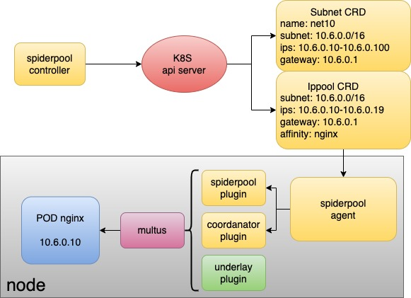

# 架构

## underlay 网络 和 overlay 网络场景的比较

云原生网络中出现了两种技术类别，“overlay 网络方案” 和 “underlay 网络方案”，
云原生网络对于它们没有严格的定义，我们可以从很多 CNI 项目的实现原理中，简单抽象出这两种技术流派的特点，它们可以满足不同场景下的需求。

[文章](./solution-zh_CN.md) 对两种方案的 IPAM 和网络性能做了简单比较，能够更好说明 Spiderpool 的特点和使用场景。

为什么需要 underlay 网络解决方案？在数据中心的场景下，存在很多应用场景：

* 低延时应用的需求，underlay 网络方案的网络延时和吞吐量会优于 overlay 网络方案

* 传统主机应用上云初期，还延传统网络的对接方式，例如服务暴露和发现、多子网对接等

* 数据中心网络管理的需求，希望使用防火墙等手段对应用实施安全管控，希望使用传统的网络观测手段实施集群网络监控

## 架构

Spiderpool 架构如上所示，包含了以下组件：

* Spiderpool controller: 是一组 deployment，实施了对各种 CRD 校验、状态更新、IP 回收、自动 IP 池的管理等

* Spiderpool agent：是一组 daemonset，其帮助 Spiderpool plugin 实施 IP 分配，帮助 coordinator plugin 实施信息同步

* Spiderpool plugin：在每个主机上的二进制插件，供 CNI 调用，实施 IP 分配

* coordinator plugin：在每个主机上的二进制插件，供 CNI 调用，实施多网卡路由调谐、IP 冲突检查、宿主机联通等

除了以上 Spiderpool 自身的组件以外，还需要配合某个开源的 underlay CNI 来给 POD 分配网卡，可配合 [multus CNI](https://github.com/k8snetworkplumbingwg/multus-cni) 来实施多网卡和 CNI 配置管理。

任何支持第三方 IPAM 插件的 CNI 项目，都可以配合 Spiderpool，例如：
[macvlan CNI](https://github.com/containernetworking/plugins/tree/main/plugins/main/macvlan),
[vlan CNI](https://github.com/containernetworking/plugins/tree/main/plugins/main/vlan),
[ipvlan CNI](https://github.com/containernetworking/plugins/tree/main/plugins/main/ipvlan),
[sriov CNI](https://github.com/k8snetworkplumbingwg/sriov-cni),
[ovs CNI](https://github.com/k8snetworkplumbingwg/ovs-cni),
[Multus CNI](https://github.com/k8snetworkplumbingwg/multus-cni)
[calico CNI](https://github.com/projectcalico/calico),
[weave CNI](https://github.com/weaveworks/weave)

## 应用场景：一个或多个 underlay CNI 协同

如上所示，Spiderpool 工作在 underlay 模式下，可配合 underlay CNI （例如 [macvlan CNI](https://github.com/containernetworking/plugins/tree/main/plugins/main/macvlan), [sriov CNI](https://github.com/k8snetworkplumbingwg/sriov-cni) ）实现:

* 为 underlay CNI 提供丰富的 IPAM 能力,包括共享/固定 IP、多网卡 IP 分配、双栈支持等

* 为 POD 接入一个或者多个 underlay 网卡，并能调谐多个 underlay CNI 网卡间的路由，以实现请求向和回复向数据路径一致，确保网络通信畅通

* 通过额外接入 veth 网卡和路由控制，帮助开源 underlay CNI 联通宿主机，实现 clusterIP 访问、应用的本地健康检测等

当一个集群中存在多种基础设置时，如何使用单一的 underlay CNI 来部署容器呢？

* 在一个集群中，部分节点是虚拟机，例如未打开混杂转发模式的 vmware 虚拟机，而部分节点是裸金属，接入了传统交换机网络。因此在两类节点上部署什么 CNI 方案呢 ？

* 在一个集群中，部分裸金属节点只具备一张 SRIOV 高速网卡，但只能提供 64 个 VF，如何在一个节点上运行更多的 POD ？

* 在一个集群中，部分裸金属节点具备 SRIOV 高速网卡，可以运行低延时应用，部分节点不具备 SRIOV 高速网卡，可以运行普通应用。但在两类节点部署上什么 CNI 方案呢 ？

结合 multus 的 CNI 配置管理和 Spiderpool IPAM 的通用性，可同时运行多种 underlay CNI，充分整合集群中各种基础设施节点的资源，来解决以上问题。

例如上图所示，在同一个集群下具备不同网络能力的节点， 有的节点具备 SR-IOV 网卡，可运行 SR-IOV CNI，有的节点具备普通的网卡，可运行 macvlan CNI ，有的节点网络访问受限（例如二层网络转发受限的 vmware 虚拟机），可运行 ipvlan CNI。

## 应用场景：overlay CNI 和 underlay CNI 协同

如上所示，Spiderpool 工作在 overlay 模式下，使用 multus 同时为为 POD 插入一张 overlay 网卡（例如 [calico](https://github.com/projectcalico/calico), [cilium](https://github.com/cilium/cilium) ）和若干张 underlay 网卡（例如 [macvlan CNI](https://github.com/containernetworking/plugins/tree/main/plugins/main/macvlan), [sriov CNI](https://github.com/k8snetworkplumbingwg/sriov-cni) ），可实现:

* 为 underlay CNI 提供丰富的 IPAM 能力,包括共享/固定 IP、多网卡 IP 分配、双栈支持等

* 为 POD 的多个 underlay CNI 网卡和 overlay 网卡调谐路由，以实现请求向和回复向数据路径一致，确保网络通信畅通

* 以 overlay 网卡作为缺省网卡，并调谐路由，通过 overlay 网卡联通本地宿主机，实现 clusterIP 访问、应用的本地健康检测、overlay 网络流量通过 overlay 网络转发，而 underlay 网络流量通过 underlay 网卡转发。

结合 multus 的 CNI 配置管理和 Spiderpool IPAM 的通用性，可同时运行一种 overlay CNI 和 多种 underlay CNI。例如，在同一个集群下具备不同网络能力的节点， 裸金属节点上的 POD 同时接入 overlay CNI 和 underlay CNI 网卡，虚拟机节点上的 POD 只提供集群东西向服务，只接入 overlay CNI 网卡。
带来了如下好处：

* 把提供东西向服务的应用只接入 overlay 网卡，提供南北向服务的应用同时接入 overlay 和 underlay 网卡，在保障集群内 POD 连通性基础上，能够降低 underlay IP 资源的用量，减少相应的人工运维成本

* 充分整合虚拟机和裸金属节点资源

