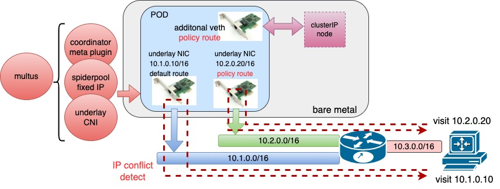

# Spiderpool architecture

## Comparison of underlay and overlay network scenarios

There are two technologies in cloud-native networking: "overlay network" and "underlay network".
Despite no strict definition for underlay and overlay networks in cloud-native networking, we can simply abstract their characteristics from many CNI projects. The two technologies meet the needs of different scenarios.

The [article](./solution.md) provides a brief comparison of IPAM and network performance between the two technologies, which offers better insights into the unique features and use cases of Spiderpool.

Why underlay network solutions? In data center scenarios, the following requirements necessitate underlay network solutions:

* Low-latency applications need optimized network latency and throughput provided by underlay networks

* Initial migration of traditional host applications to the cloud use traditional network methods such as service exposure and discovery and multi subnets

* Network management in the data center desires security controls such as firewalls and traditional network observation techniques to implement cluster network monitoring.

## Architecture

Spiderpool consists of the following components:

* Spiderpool controller: a set of deployments that manage CRD validation, status updates, IP recovery, and automated IP pools

* Spiderpool agent: a set of daemonsets that help Spiderpool plugin by performing IP allocation and coordinator plugin for information synchronization.

* Spiderpool plugin: a binary plugin on each host that CNI can utilize to implement IP allocation.

* coordinator plugin: a binary plugin on each host that CNI can use for multi-NIC route coordination, IP conflict detection, and host connectivity.

On top of its own components, Spiderpool relies on open-source underlay CNIs to allocate network interfaces to Pods. You can use [Multus CNI](https://github.com/k8snetworkplumbingwg/multus-cni) to manage multiple NICs and CNI configurations.

Any CNI project compatible with third-party IPAM plugins can work well with Spiderpool, such as:

[Macvlan CNI](https://github.com/containernetworking/plugins/tree/main/plugins/main/macvlan), 
[vlan CNI](https://github.com/containernetworking/plugins/tree/main/plugins/main/vlan), 
[ipvlan CNI](https://github.com/containernetworking/plugins/tree/main/plugins/main/ipvlan), 
[SR-IOV CNI](https://github.com/k8snetworkplumbingwg/sriov-cni), 
[ovs CNI](https://github.com/k8snetworkplumbingwg/ovs-cni), 
[Multus CNI](https://github.com/k8snetworkplumbingwg/multus-cni), 
[Calico CNI](https://github.com/projectcalico/calico), 
[Weave CNI](https://github.com/weaveworks/weave)

## Use case: collaborate with one or more underlay CNIs

In underlay networks, Spiderpool can work with underlay CNIs such as [Macvlan CNI](https://github.com/containernetworking/plugins/tree/main/plugins/main/macvlan) and [SR-IOV CNI](https://github.com/k8snetworkplumbingwg/sriov-cni) to provide the following benefits:

* Rich IPAM capabilities for underlay CNIs, including shared/fixed IPs, multi-NIC IP allocation, and dual-stack support

* One or more underlay NICs for Pods with coordinating routes between multiple NICs to ensure smooth communication with consistent request and reply data paths

* Enhanced connectivity between open-source underlay CNIs and hosts using additional veth network interfaces and route control. This enables clusterIP access, local health checks of applications, and much more

How can you deploy containers using a single underlay CNI, when a cluster has multiple underlying setups?

* Some nodes in the cluster are virtual machines like VMware that don't enable promiscuous mode, while others are bare metal and connected to traditional switch networks. What CNI solution should be deployed on each type of node?

* Some bare metal nodes only have one SR-IOV high-speed NIC that provides 64 VFs. How can more pods run on such a node?

* Some bare metal nodes have an SR-IOV high-speed NIC capable of running low-latency applications, while others have only ordinary network cards for running regular applications. What CNI solution should be deployed on each type of node?

By simultaneously deploying multiple underlay CNIs through Multus CNI configuration and Spiderpool's IPAM abilities, resources from various infrastructure nodes across the cluster can be integrated to solve these problems.

For example, as shown in the above diagram, different nodes with varying networking capabilities in a cluster can use various underlay CNIs, such as SR-IOV CNI for nodes with SR-IOV network cards, Macvlan CNI for nodes with ordinary network cards, and ipvlan CNI for nodes with restricted network access (e.g., VMware virtual machines with limited layer 2 network forwarding).

## Use case: collaborate with overlay and underlay CNIs

In overlay networks, Spiderpool uses Multus to add an overlay NIC (such as [Calico](https://github.com/projectcalico/calico) or [Cilium](https://github.com/cilium/cilium)) and multiple underlay NICs (such as Macvlan CNI or SR-IOV CNI) for each Pod. This offers several benefits:

* Rich IPAM features for underlay CNIs, including shared/fixed IPs, multi-NIC IP allocation, and dual-stack support.

* Route coordination for multiple underlay CNI NICs and an overlay NIC for Pods, ensuring the consistent request and reply data paths for smooth communication.

* Use the overlay NIC as the default one with route coordination and enable local host connectivity to enable clusterIP access, local health checks of applications, and forwarding overlay network traffic through overlay networks while forwarding underlay network traffic through underlay networks.

The integration of Multus CNI and Spiderpool IPAM enables the collaboration of an overlay CNI and multiple underlay CNIs. For example, in clusters with nodes of varying network capabilities, Pods on bare-metal nodes can access both overlay and underlay NICs. Meanwhile, Pods on virtual machine nodes only serving east-west services are connected to the Overlay NIC.
This approach provides several benefits:

* Applications providing east-west services can be restricted to being allocated only the overlay NIC while those providing north-south services can simultaneously access overlay and underlay NICs. This results in reduced Underlay IP resource usage, lower manual maintenance costs, and preserved pod connectivity within the cluster.

* Fully integrate resources from virtual machines and bare-metal nodes.

